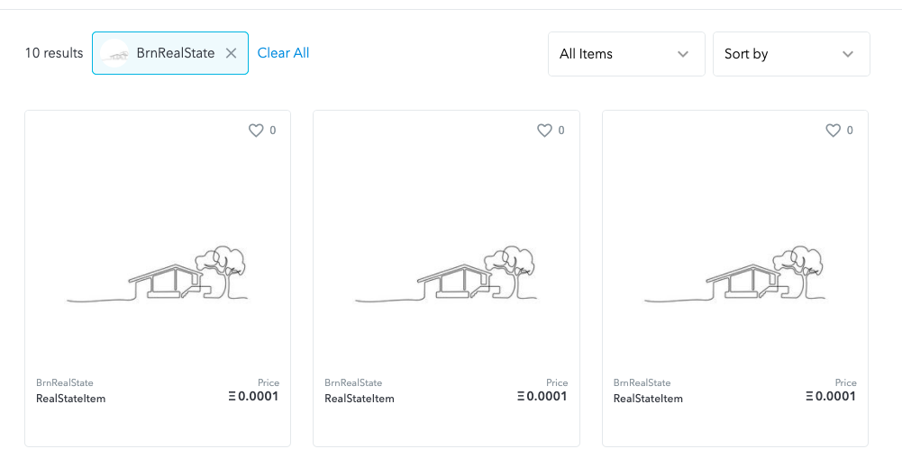

# Udacity Blockchain Capstone

The capstone will build upon the knowledge you have gained in the course in order to build a decentralized housing product.

# Project Resources

* [Remix - Solidity IDE](https://remix.ethereum.org/)
* [Visual Studio Code](https://code.visualstudio.com/)
* [Truffle Framework](https://truffleframework.com/)
* [Ganache - One Click Blockchain](https://truffleframework.com/ganache)
* [Open Zeppelin ](https://openzeppelin.org/)
* [Interactive zero knowledge 3-colorability demonstration](http://web.mit.edu/~ezyang/Public/graph/svg.html)
* [Docker](https://docs.docker.com/install/)
* [ZoKrates](https://github.com/Zokrates/ZoKrates)

## About the project

This Dapp is a house listing service

### Problems to solve

- Property titles are often paper-based, creating opportunities for errors and fraud
- Title professionals find defects in 25% of all titles during the transaction process, according to the American Land Title Association
- Any identified defect makes it illegal to transfer a property title to a buyer until it's rectified (property owners often incur high legal fees to ensure authenticity and accuracy of their property titles).
- Title fraud poses a risk to homeowners worldwide. US losses associated with title fraud reportedly averaged around $ 103,000 per case in 2015, compelling many property buyers to purchase title insurance.

### Solution

The title management issues could potentially be mitigated by using Blockchain technology to build immutable digital records of land titles and using blockchain for transparent transactions. This approach could simplify property title management, making it more transparent and helping to reduce the risk of title fraud and the need for additional insurance.
Some companies and governments around the globe have already implemented blockchain technology for the title management process.

### Steps of the project
- Mint own tokens to represent the title to the properties
    - Before minting a token, it's needed to verify the owner of the property
    - It's used zkSNARKs to create a verification system which can prove I have title to the property without revealing that specific information on the property
- After the token as been verified I will place it on blockchain market place (Open sea) for others to purchase.

### About OpenSea
This is a descentralized marketplace used for selling crypto assets that are powered off Ethereum.
It's used in this project to list the property tokens for sale.

### Tests
```
Contract: TestERC721Mintable
    match erc721 spec
      ✓ should return total supply
      ✓ should get token balance (81ms)
      ✓ should return token uri (154ms)
      ✓ should transfer token from one owner to another (281ms)
    have ownership properties
      ✓ should fail when minting when address is not contract owner (122ms)
      ✓ should return contract owner (175ms)

  Contract: TestSolnSquareVerifier
    ✓ a new solution can be added for contract (95ms)
    ✓ an ERC721 token can be minted for contract (2225ms)

  Contract: TestSquareVerifier
    Test verification
      ✓ with correct proof (1021ms)
      ✓ with incorrect proof (1121ms)


  10 passing (14s)
```

### Deployment
```
Starting migrations...
======================
> Network name:    'rinkeby'
> Network id:      4
> Block gas limit: 10000000 (0x989680)


1_initial_migration.js
======================

   Replacing 'Migrations'
   ----------------------
   > transaction hash:    0x4df34ac7301a92993b52bf3958c576b6edbf54f96eb7427254744f7664b3cfd0
   > Blocks: 0            Seconds: 13
   > contract address:    0x2E258D2322A734350b88da72665f68144ab93178
   > block number:        8370452
   > block timestamp:     1617790440
   > account:             0xCCd8b02CCb65266F1742650131552B836DEE2617
   > balance:             18.519109558
   > gas used:            226537 (0x374e9)
   > gas price:           10 gwei
   > value sent:          0 ETH
   > total cost:          0.00226537 ETH


   > Saving migration to chain.
   > Saving artifacts
   -------------------------------------
   > Total cost:          0.00226537 ETH


2_deploy_contracts.js
=====================

   Replacing 'SolnSquareVerifier'
   ------------------------------
   > transaction hash:    0x630695f2c9f363e1bf4787ad584b8bd1ecf64932609609d7004ecd6827a6982d
   > Blocks: 1            Seconds: 9
   > contract address:    0x69c72FC8227A56dFeFa39598f415b8db233dA703
   > block number:        8370454
   > block timestamp:     1617790470
   > account:             0xCCd8b02CCb65266F1742650131552B836DEE2617
   > balance:             18.475878858
   > gas used:            4277307 (0x41443b)
   > gas price:           10 gwei
   > value sent:          0 ETH
   > total cost:          0.04277307 ETH


   Replacing 'Verifier'
   --------------------
   > transaction hash:    0x7f29e9a2a295f8dbe5eea4d4ea66b8e8d38f327cb22c4600f1f6f1e2d07dcf2e
   > Blocks: 0            Seconds: 8
   > contract address:    0x6A600c03b8779B197b64bf914570E0ADaD3437C8
   > block number:        8370455
   > block timestamp:     1617790485
   > account:             0xCCd8b02CCb65266F1742650131552B836DEE2617
   > balance:             18.466202308
   > gas used:            967655 (0xec3e7)
   > gas price:           10 gwei
   > value sent:          0 ETH
   > total cost:          0.00967655 ETH


   Replacing 'CustomERC721Token'
   -----------------------------
   > transaction hash:    0x5d766071a291d876e47060e136b7af41180d39a9a0186cb8ca9a1573b20f01bf
   > Blocks: 1            Seconds: 9
   > contract address:    0x0291100B65bb47cE9955d3CFc8f7bda6E3c4a836
   > block number:        8370456
   > block timestamp:     1617790500
   > account:             0xCCd8b02CCb65266F1742650131552B836DEE2617
   > balance:             18.437983408
   > gas used:            2821890 (0x2b0f02)
   > gas price:           10 gwei
   > value sent:          0 ETH
   > total cost:          0.0282189 ETH


   > Saving migration to chain.
   > Saving artifacts
   -------------------------------------
   > Total cost:          0.08066852 ETH


Summary
=======
> Total deployments:   4
> Final cost:          0.08293389 ETH
```

### OpenSea result

The result can be seen on OpenSea, in the following link: https://testnets.opensea.io/assets/brnrealstate

